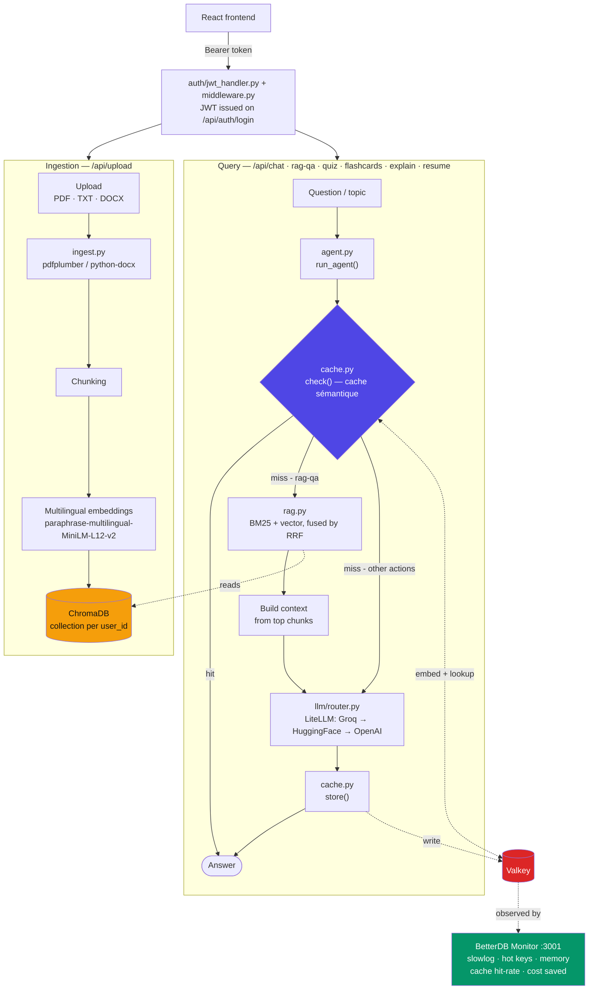
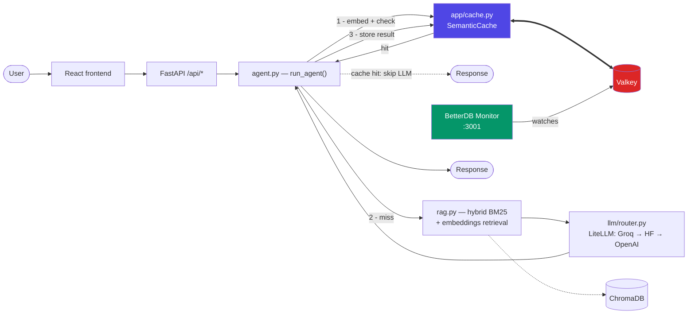
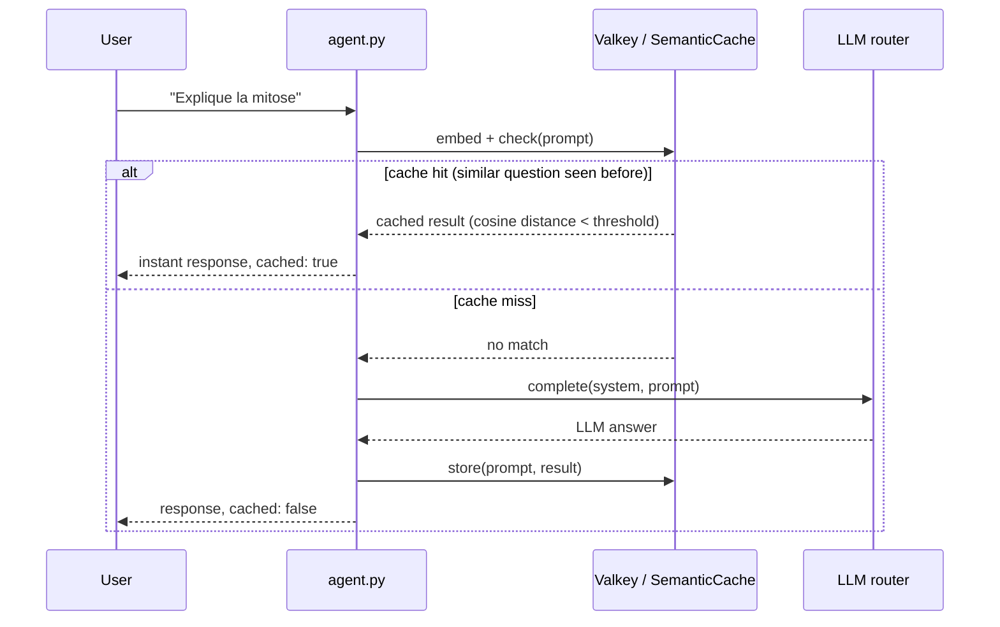

<p align="center">
  
</p>

<h1 align="center">PaperBrain</h1>
<p align="center"><strong>Your AI-powered study assistant — chat, quiz, explain, summarize, and more.</strong></p>

<p align="center">
  <a href="https://huggingface.co/spaces/ApyHTML19/PaperBrainAI">
    
  </a>
  <a href="https://github.com/ApyHtml20/PaperBrain">
    
  </a>
  
  
  
  
  
</p>

<p align="center">
  
</p>

---

## What is PaperBrain?

PaperBrain turns your documents into an interactive study session. Upload a PDF, ask questions about it, generate a quiz, get flashcards, or request a plain-English explanation — all in one place.

It runs on a **FastAPI + React** stack with **Qwen 2.5-72B** via HuggingFace for cloud inference, **ChromaDB** for document retrieval (RAG), **Valkey + BetterDB** for semantic caching and observability, and an optional **local n8n AI Agent** powered by Ollama for fully offline automation.

---

## Features

| | Feature | Description |
|---|---|---|
| 💬 | **General Chat** | Study assistant backed by Qwen 2.5-72B |
| 📄 | **RAG Mode** | Ask questions directly about your uploaded documents |
| 🧪 | **Quiz** | Auto-generated multiple-choice quizzes on any topic |
| 🃏 | **Flashcards** | Smart cards for active recall and memorization |
| 💡 | **Explain** | Concept breakdowns at beginner / intermediate / advanced level |
| 📝 | **Summarize** | Auto-summarize any text or uploaded document |
| 📁 | **Document Manager** | Upload PDF, TXT, DOCX — indexed per user with isolation |
| 👤 | **Auth** | JWT-based register/login with per-user data separation |
| 📊 | **Profile & Stats** | Quiz history, streaks, and progression tracking |
| 🔄 | **n8n AI Agent** | Local agent with Ollama (llama3.1 / Qwen 2.5) + 5 tools |
| ⚡ | **Semantic Cache** | Valkey-backed cache that hits on *meaning*, not exact text — paraphrased questions skip the LLM entirely |
| 🔭 | **Observability** | BetterDB watches Valkey + the semantic cache live — hit-rate, cost saved, slowlog, hot keys |

---

## Architecture

### Pipeline

Two pipelines share the same backend: **ingestion** (turning an uploaded file into searchable vectors) and **query** (turning a question into a cached-or-generated answer). Both are backed by per-user isolation end to end.



### Folder structure

```
PaperBrain/
├── backend/                        # FastAPI Python backend
│   ├── app/
│   │   ├── auth/
│   │   │   ├── jwt_handler.py      # JWT token creation/decoding
│   │   │   └── middleware.py       # get_current_user dependency
│   │   ├── db/
│   │   │   ├── database.py         # SQLite + SQLAlchemy setup
│   │   │   ├── models.py           # User, QuizResult, StudySession
│   │   │   └── crud.py             # DB operations
│   │   ├── tools/                  # AI tool modules
│   │   ├── agent.py                # Main AI dispatcher — checks/fills the cache
│   │   ├── cache.py                # Valkey + BetterDB semantic cache (app/cache.py)
│   │   ├── ingest.py               # Document ingestion + chunking
│   │   ├── rag.py                  # ChromaDB vector store
│   │   ├── router_service.py       # API routes
│   │   ├── schemas.py              # Pydantic request models
│   │   └── main.py                 # FastAPI app entry point
│   ├── Dockerfile
│   └── requirements.txt
├── frontend/                       # React frontend
│   └── src/
│       └── pages/
│           ├── Chat.jsx
│           ├── Quiz.jsx
│           ├── Flashcards.jsx
│           ├── Documents.jsx
│           └── Profile.jsx
├── n8n/                            # Local n8n AI Agent
│   └── workflows/
│       └── PaperBrain.json
└── docs/
    ├── logo.png
    └── n8n-workflow.png
```

---

## Local Setup

### Prerequisites

- Python 3.10+
- Node.js 18+
- Ollama *(only required for the n8n local agent)*

### 1 — Clone the repository

```bash
git clone https://github.com/ApyHtml20/PaperBrain.git
cd PaperBrain
```

### 2 — Backend

```bash
cd backend
pip install -r requirements.txt
```

Create a `.env` file:

```env
SECRET_KEY=your_secret_key_here

# LLM routing (app/llm/) — set at least one; the app cascades through
# whichever of these are present, in this order by default.
GROQ_API_KEY=your_groq_key
HF_TOKEN=your_huggingface_token
OPENAI_API_KEY=your_openai_key

# Optional overrides
GROQ_MODEL=groq/llama-3.3-70b-versatile
HF_MODEL=Qwen/Qwen2.5-72B-Instruct
OPENAI_MODEL=gpt-4o-mini
LLM_FALLBACK_ORDER=groq,huggingface,openai

# Cache (app/cache.py) — needs a running Valkey, see step 4 below.
# Safe to leave everything at its default: a Valkey outage just disables the
# cache and falls back to normal (uncached) LLM calls.
VALKEY_HOST=localhost
VALKEY_PORT=6379
SEMANTIC_CACHE_ENABLED=true
SEMANTIC_CACHE_THRESHOLD=0.12
SEMANTIC_CACHE_TTL=86400
```

Start Valkey (needed even outside Docker Compose — see step 4):

```bash
docker run -d -p 6379:6379 valkey/valkey:8-alpine
```

Start the server:

```bash
uvicorn app.main:app --reload --port 8000
```

### 3 — Frontend

```bash
cd frontend
npm install
npm run dev
```

### 4 — n8n + Ollama *(optional)*

```bash
# Install and start Ollama, then pull the model
ollama pull llama3.1

# Install and start n8n
npm install -g n8n
n8n start
# → http://localhost:5678
```

Then in n8n:
1. Go to **Workflows → Import**
2. Import `n8n/workflows/PaperBrain.json`
3. Set the Ollama node URL to `http://localhost:11434`
4. Click **Publish**

### 5 — Cache + Observability (recommended)

The whole stack — backend, frontend, Valkey, and BetterDB Monitor — runs with one command:

```bash
docker compose up -d
```

| Service | URL | What it's for |
|---|---|---|
| BetterDB Monitor | http://localhost:3001 | Live Valkey health (memory, slowlog, hot keys) + semantic-cache hit-rate, cost saved, and threshold recommendations |
| Backend API | http://localhost:8000 | FastAPI |
| Frontend | http://localhost:5173 | React app |

Running the backend outside Docker (step 2 above)? Point it at any Valkey instance with `VALKEY_HOST` / `VALKEY_PORT` — see the `.env` block in step 2.

---

## n8n AI Agent

<p align="center">
  
</p>

The local n8n agent orchestrates all learning tools automatically using **Ollama llama3.1** — no cloud required.

```
[Postman / Frontend]
        ↓
  [AI Agent (RAG)]  ←→  [Ollama — llama3.1]
        ↓
  ┌─────┴─────────────────────────────────┐
  │           │           │        │       │
[Flashcards] [Explain] [RAG] [Summarize] [Quiz]
        ↓
[Frontend Output]
```

| Tool | What it does |
|---|---|
| 🃏 Flashcards | Generate flashcards on any topic |
| 💡 Explain | Explain a concept at any depth |
| 📄 RAG | Search your uploaded documents |
| 📝 Summarize | Summarize topics automatically |
| 🧪 Quiz | Generate multiple-choice questions |

---

## Cache & Observability

Five of the six AI actions (`rag-qa`, `quiz`, `flashcards`, `explain`, `resume`) go through a **semantic cache** before they go anywhere near an LLM. Unlike a plain key-value cache, it hits on *meaning*: "C'est quoi la mitose ?" and "Peux-tu m'expliquer la mitose ?" embed to nearly the same vector, so the second question is served from Valkey in milliseconds instead of triggering another Groq/HuggingFace/OpenAI call. `chat` is deliberately excluded — its answer depends on recent conversation history that a single cached query can't represent, so caching it could replay a reply from an unrelated conversation.



**Cache hit vs. cache miss:**



### Why Valkey + BetterDB

- **[Valkey](https://valkey.io)** — Linux Foundation fork of Redis, protocol-compatible, open-source license. Drop-in cache backend, nothing app-specific about it.
- **[BetterDB](https://www.betterdb.com)** — purpose-built to observe *exactly* this pairing: it watches Valkey directly (slowlog, hot keys, memory, ops/sec) and auto-discovers every `SemanticCache` instance registered in Valkey's `__betterdb:caches` hash, so hit-rate, cost saved, and similarity-threshold recommendations show up in its dashboard with zero extra wiring.

### Cache isolation

`rag-qa` can echo a user's own uploaded documents back in the answer, so each user gets their **own cache namespace** — same isolation model as the per-user ChromaDB collections. `quiz`, `flashcards`, `explain`, and `resume` only ever depend on a topic string, nothing user-specific, so those are cached **globally**: the first person who asks for a "quiz on photosynthesis" pays the LLM cost, everyone after gets it free. See `SHARED_CACHE_ACTIONS` in `backend/app/cache.py`.

### Configuration

| Variable | Default | Purpose |
|---|---|---|
| `VALKEY_HOST` / `VALKEY_PORT` | `valkey` / `6379` (Docker) — `localhost` / `6379` (local) | Where the backend finds Valkey |
| `SEMANTIC_CACHE_ENABLED` | `true` | Kill switch — `false` bypasses the cache entirely |
| `SEMANTIC_CACHE_THRESHOLD` | `0.12` | Max cosine distance for a hit; lower = stricter matching |
| `SEMANTIC_CACHE_TTL` | `86400` (24h) | How long a cached answer stays valid |
| `BETTERDB_ENCRYPTION_KEY` | dev placeholder | At-rest encryption key for BetterDB's stored credentials — **set a real one in production** |

A Valkey outage never breaks the app — `app/cache.py` swallows connection errors and falls back to an uncached LLM call, so caching is strictly an optimization, never a hard dependency.

---

## API Reference

### Auth

| Method | Route | Description |
|---|---|---|
| `POST` | `/api/auth/register` | Create a new account |
| `POST` | `/api/auth/login` | Log in and receive a JWT token |

### Learning *(requires auth)*

| Method | Route | Description |
|---|---|---|
| `POST` | `/api/chat` | General AI chat |
| `POST` | `/api/rag-qa` | Chat with your documents |
| `POST` | `/api/quiz` | Generate an MCQ quiz |
| `POST` | `/api/flashcards` | Generate flashcards |
| `POST` | `/api/explain` | Explain a concept |
| `POST` | `/api/resume` | Summarize text |

### Documents *(requires auth)*

| Method | Route | Description |
|---|---|---|
| `GET` | `/api/documents` | List your documents |
| `POST` | `/api/upload` | Upload a PDF, TXT, or DOCX file |
| `DELETE` | `/api/documents/{filename}` | Delete a document |

---

## Deploying to Hugging Face Spaces

```dockerfile
FROM python:3.11-slim
WORKDIR /code
COPY requirements.txt .
RUN pip install --no-cache-dir -r requirements.txt
COPY . .
CMD ["uvicorn", "app.main:app", "--host", "0.0.0.0", "--port", "7860"]
```

Add these under **Settings → Variables and secrets**:

```
HF_TOKEN=...
HF_MODEL=Qwen/Qwen2.5-72B-Instruct
SECRET_KEY=...
```

---

## Tech Stack

**Backend** — FastAPI · SQLite + SQLAlchemy · ChromaDB (hybrid BM25 + multilingual embeddings, per-user collections) · LiteLLM (Groq / HuggingFace / OpenAI cascade) · Valkey + BetterDB semantic cache · python-jose · pdfplumber · python-docx

**Observability** — BetterDB Monitor (Valkey health + semantic-cache analytics)

**Frontend** — React 18 · Vite

**Local AI** — n8n · Ollama · llama3.1

**Deployment** — Hugging Face Spaces (Docker)

---

## Security

- Passwords hashed with SHA-256 + random salt
- JWT tokens expire after 24 hours
- All routes protected by auth middleware
- Documents and ChromaDB collections isolated by `user_id`
- Files stored under `documents/{user_id}/`

---

## Live Demo

🔗 [huggingface.co/spaces/ApyHTML19/PaperBrainAI](https://huggingface.co/spaces/ApyHTML19/PaperBrainAI)
